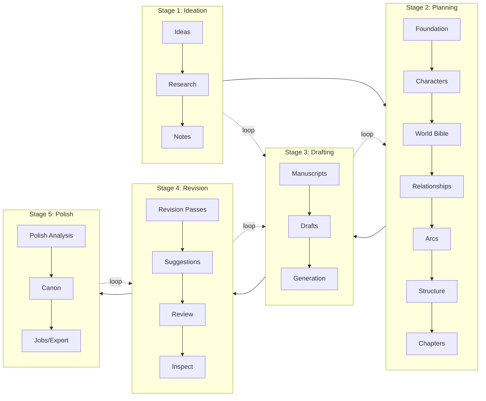

# Writer Workflow - Executor-Ready Flow Specification

Date: 2026-05-23
Status: Execution reference

## 1. Workflow Model

## 2. Canonical Mapping to App Surfaces

| Stage | Panel Keys | APIs |
|---|---|---|
| Ideation | ideas, research, notes | `/v1/story-development/brainstorm/*`, `/v1/story-development/braindump/*`, `/v1/story-development/research/*` |
| Planning | foundation, characters, worldBible, relationships, arcs, structure, chapters | `/v1/story-development/foundation/*`, `/v1/story-development/characters/*`, `/v1/story-development/world-bible/*`, `/v1/story-development/relationships/*`, `/v1/story-development/arcs/*`, `/v1/story-development/planning/*` |
| Drafting | manuscripts, drafts, generation | `/v1/story-development/drafting/manuscript-documents/*`, `/v1/story-development/drafting/draft-artifacts/*`, `/v1/story-generation/*` |
| Revision | revision, suggestions, review, inspect | `/v1/story-development/revision/*`, `/v1/story-development/drafting/revision-suggestions/*`, `/v1/story-development/review/*`, `/v1/story-development/review/inspect-links*` |
| Polish | polish, canon, jobs | `/v1/story-development/polish/*`, `/v1/story-development/canon/*`, `/v1/jobs/*` |

## 3. Navigation Requirements (Testable)

1. Any-to-any panel navigation works without losing active unsaved panel state.
2. Deep links to inspect remain valid (`/workspace/:projectId/inspect/:jobId`).
3. Rail and context labels map 1:1 to actual `StudioPanelKey` values.
4. No stage item points to a non-renderable panel.

## 4. Execution Sequence

1. Add new contracts and persistence for Research.
2. Add new contracts and persistence for Revision.
3. Add new contracts and async flow for Polish.
4. Update `studioStore` panel keys and default sizes.
5. Reorganize `StudioProjectRail` and `StudioContextPanel` by stage.
6. Wire `StudioPanelContent` cases for all added keys.
7. Validate backend and frontend full gates.

## 5. Acceptance Checklist

- [ ] 19 panel keys registered and routable.
- [ ] Research CRUD functional.
- [ ] Revision lifecycle and checklist workflow functional.
- [ ] Polish analysis and export status flow functional.
- [ ] All new API routes under `/v1/story-development/*`.
- [ ] Frontend lint/typecheck/build/test pass.
- [ ] Backend parallel + serial suites pass with required timeouts.
